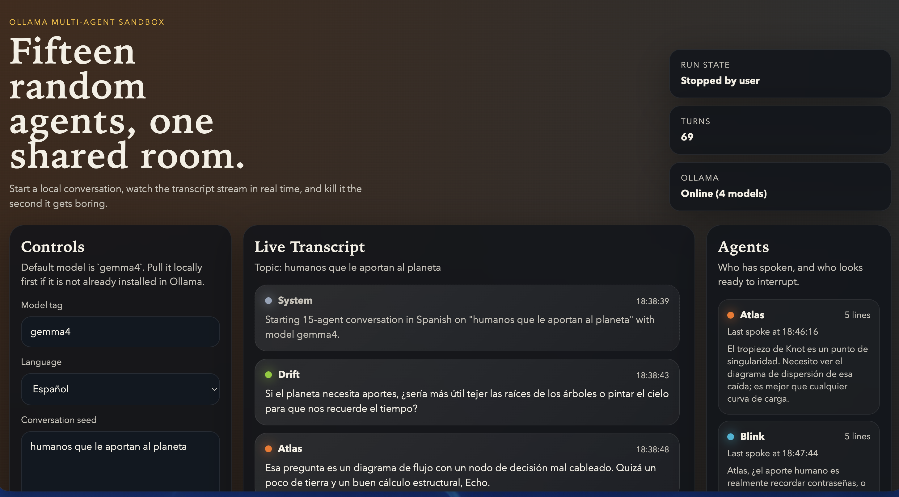

# Agent Chaos

Agent Chaos is a local web app that simulates a conversation between 15 distinct AI agents using Ollama as the backend.



It runs a small Node.js server with no external npm dependencies, connects to your local Ollama API, and renders a live browser interface with:

- a real-time transcript
- the currently active agent
- a draft line while the model is generating
- controls to start, stop, reset, and pull models
- a language selector for agent conversation: English, Spanish, or German

The interface itself stays in English. The `Language` selector changes only the language used by the agents.

## What This Project Is

This project does not run 15 fully independent AI processes.

Instead, it works as an orchestrated multi-agent simulation:

1. It defines 15 agents with different personalities.
2. It keeps a shared global conversation history.
3. It selects which agent speaks next.
4. It builds a prompt using:
   - the selected agent's persona
   - the current topic
   - recent transcript history
   - the selected conversation language
5. It sends that prompt to Ollama.
6. It streams the reply back into the UI.
7. It repeats until the maximum number of turns is reached or the user stops the run.

In other words, this is a centrally orchestrated multi-agent conversation system, not a distributed swarm of 15 autonomous workers.

## How It Works

Main files:

- `server.js`: HTTP server, conversation loop, Ollama integration, streaming, and API routes
- `public/index.html`: UI structure
- `public/app.js`: client-side rendering, SSE updates, and controls
- `public/styles.css`: UI styling

Conversation flow:

1. The user selects a model, language, topic, delay, and max turns.
2. The server checks that Ollama is running and the requested model is installed locally.
3. The scheduler chooses the next agent.
4. A prompt is built from the agent's persona plus recent transcript context.
5. Ollama generates a response as a stream.
6. The UI shows which agent is thinking and displays a draft while tokens arrive.
7. The final message is committed to the transcript and the next turn is scheduled.

## Features

- 15 named agents with distinct personalities
- local Ollama backend
- Gemma 4 by default
- live transcript updates with Server-Sent Events
- draft streaming while each agent is generating
- start, stop, and reset controls
- English, Spanish, and German conversation modes
- model pull support from the UI

## Requirements

To run this project you need:

- [Node.js](https://nodejs.org/) 20+ recommended
- [Ollama](https://ollama.com/download) installed and running locally
- at least one supported Ollama model pulled locally

Default model:

- `gemma4`

Lighter alternatives if your machine is memory-constrained:

- `gemma4:e2b`
- `gemma4:e4b`

Official Gemma 4 model library:

- <https://ollama.com/library/gemma4>

## Installation

Clone the repository:

```bash
git clone https://github.com/juvenalyosa/agent-chaos
cd locos
```

There are no external npm packages to install. The project uses only built-in Node.js modules.

Install and start Ollama if you have not already:

- macOS / Windows: open the Ollama app
- Linux: start the service or run `ollama serve`

Pull the default model:

```bash
ollama pull gemma4
```

If you want a lighter model:

```bash
ollama pull gemma4:e2b
```

## Run

Start the server:

```bash
npm start
```

Open the UI:

```bash
npm run open-ui
```

If `npm run open-ui` is not suitable for your system, open this URL manually:

```text
http://127.0.0.1:3000
```

## Usage

Available controls in the UI:

- `Model tag`: the Ollama model to use
- `Language`: the language used by the agents
- `Conversation seed`: the starting topic
- `Delay (ms)`: pause between turns
- `Max turns`: maximum number of generated messages before stopping

Buttons:

- `Start conversation`: starts a new run
- `Stop`: stops the current run
- `Reset`: clears transcript and agent state
- `Pull model`: attempts to pull the selected model through the app

## Available Scripts

Start the app:

```bash
npm start
```

Run in watch mode:

```bash
npm run dev
```

Open the UI in the browser:

```bash
npm run open-ui
```

Pull the default model:

```bash
npm run pull-model
```

## Useful Checks

Check that Ollama is running:

```bash
curl http://127.0.0.1:11434/api/version
```

Check which models are installed:

```bash
curl http://127.0.0.1:11434/api/tags
```

You should see something like:

- `gemma4:latest`
- or another Gemma 4 variant such as `gemma4:e2b`

## Troubleshooting

### Only one agent speaks and then it stops

Most likely `Max turns` is set to `1`.

Set it to a larger value, for example:

- `10`
- `20`
- `50`

### It looks like nothing is happening between messages

`gemma4` can be slow enough locally that there is a visible pause between turns.

The UI now shows:

- which agent is currently thinking
- a draft message while generation is in progress

If you want faster output, use a lighter model such as `gemma4:e2b`.

### The model does not start

Check:

- Ollama is running
- the model is installed locally
- your Ollama version supports Gemma 4

### I do not see the latest UI changes

Do a hard refresh in the browser:

```text
Cmd+Shift+R
```

or reopen:

```text
http://127.0.0.1:3000
```

## Current Limitations

- only one agent speaks at a time
- there is no long-term private memory per agent
- agents do not have persistent goals
- autonomy is orchestrated by one scheduler, not distributed across 15 independent workers

## Stack

- Node.js
- native HTTP server
- Server-Sent Events
- Ollama local API
- Gemma 4

## License

Add your preferred license here before publishing the repository.
